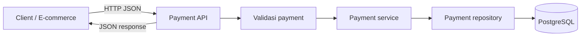
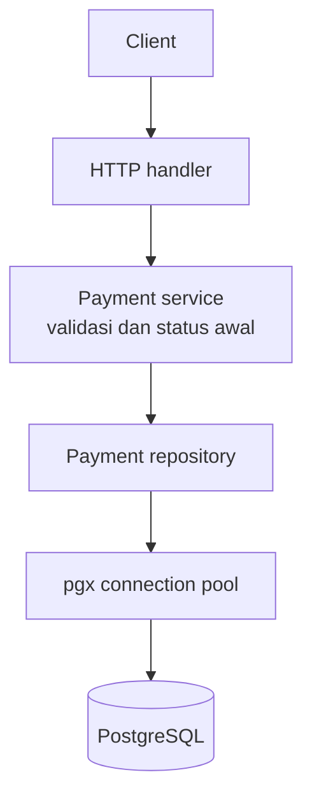

# Financial Payment Integration API

REST API berbasis Go untuk demo integrasi pembayaran dan pemodelan domain keuangan. Kode saat ini menyediakan API payment, idempotency key, verifikasi signature webhook, transisi status, posting ledger debit/kredit, endpoint customer/account, static Swagger UI, serta simulasi in-memory retry queue.

Payment dan webhook menggunakan repository PostgreSQL. Customer/account handler dan repository juga tersedia, tetapi migrasi domain `005`/`006` belum kompatibel dengan skema payment runtime `001`-`004`; lihat catatan database sebelum menjalankan endpoint tersebut.

## Masalah Bisnis

Aplikasi e-commerce membutuhkan satu pintu integrasi untuk mencatat permintaan pembayaran secara konsisten. API ini menjadi tempat validasi request dan penyimpanan transaksi sebelum integrasi payment provider ditambahkan. Status `PENDING` berarti transaksi tercatat, bukan berarti provider sudah memproses atau menyetujui pembayaran.



## Alur Create Payment

1. Client mengirim `reference`, `amount`, dan `currency` ke `POST /api/v1/payments`.
2. Handler membaca satu objek JSON dan menolak field yang tidak dikenal.
3. Service memvalidasi reference, amount positif, dan kode currency tiga huruf; currency dinormalisasi menjadi huruf kapital.
4. Service menetapkan status awal `PENDING`.
5. Repository menyimpan transaksi. Reference yang sudah digunakan ditolak oleh constraint unik database. Jika header `Idempotency-Key` dikirim, payment dan key dibuat dalam satu transaksi PostgreSQL: kegagalan menyimpan salah satunya me-rollback keduanya. Key yang sudah digunakan menghasilkan `409 Conflict` (request tidak di-replay sebagai response sukses).
6. API mengembalikan transaksi yang tersimpan dengan HTTP `201 Created`.

## Arsitektur Saat Ini



Kode dipisah ke `handler`, `service`, `repository`, `model`, `database`, `config`, dan `queue`. Endpoint health check tersedia di `/health`. Retry queue bersifat in-memory dan belum dijalankan oleh server API.

## Webhook dan Ledger

Endpoint `POST /api/v1/webhooks/payment` memerlukan header `X-Webhook-Signature` dengan nilai `sha256=<hex HMAC-SHA256 dari raw request body menggunakan WEBHOOK_SECRET>`. Event yang didukung: `payment.success` dan `payment.failed`.

Untuk `payment.success`, satu transaksi PostgreSQL memasukkan event webhook, mengubah status payment dari `PENDING`/`PROCESSING` ke `SUCCESS`, lalu mencatat satu debit dan satu kredit. Unique `event_id` mencegah event yang sama diproses ulang. Ledger ditulis hanya di repository dalam transaksi tersebut; service tidak melakukan posting kedua. Event berbeda untuk payment yang sudah terminal ditolak sebagai transisi status tidak valid.

Contoh payload:

```json
{
	"event_id": "evt-001",
	"type": "payment.success",
	"reference": "PAY-001"
}
```

Kode akun demo yang dipakai adalah `1010` (debit) dan `2010` (kredit). Ini simulasi posting, bukan integrasi gateway atau chart of accounts produksi.

## API

### Membuat payment

`POST /api/v1/payments`

Request:

```json
{
	"reference": "PAY-001",
	"amount": 150000,
	"currency": "IDR"
}
```

Response `201 Created`:

```json
{
	"id": 1,
	"reference": "PAY-001",
	"amount": 150000,
	"currency": "IDR",
	"status": "PENDING",
	"created_at": "2026-09-30T03:00:00Z",
	"updated_at": "2026-09-30T03:00:00Z"
}
```

### Melihat semua payment

`GET /api/v1/payments` mengembalikan array payment. Jika belum ada transaksi, response berupa `[]`.

### Melihat payment berdasarkan ID

`GET /api/v1/payments/{id}` mengembalikan satu payment. ID yang tidak ditemukan menghasilkan `404 Not Found`.

### Customer dan account

- `GET /api/v1/customers` dan `POST /api/v1/customers`
- `GET /api/v1/customers/{id}`
- `POST /api/v1/accounts`
- `GET /api/v1/accounts/{id}`
- `GET /api/v1/customers/{customer_id}/accounts`

Validasi customer/account tersedia di service. Endpoint ini memerlukan tabel domain yang didefinisikan pada migration `005`/`006`; skema tersebut saat ini belum dapat digunakan bersama payment repository tanpa rekonsiliasi migrasi.

### Swagger UI

Setelah server berjalan, buka `http://localhost:8080/docs` atau `http://localhost:8080/swagger/`. OpenAPI JSON tersedia di `http://localhost:8080/swagger/swagger.json`. Ubah port URL jika `APP_PORT` bukan `8080`.

### Status error

- `400 Bad Request`: JSON atau input payment tidak valid.
- `404 Not Found`: ID payment tidak ditemukan.
- `409 Conflict`: reference sudah digunakan.
- `500 Internal Server Error`: kegagalan internal.

## Database

Jalur migration yang sesuai dengan payment/webhook repository saat ini adalah `001_create_payments.sql` sampai `004_create_idempotency_and_ledger.sql`. Jalur ini menggunakan payment ID BIGINT, tabel `webhook_events`, `idempotency_keys`, dan `ledger_entries` berbasis `payment_reference`.

Migration `005_financial_domain_schema.sql` dan `006_full_financial_domain_schema.sql` adalah rancangan domain yang lebih luas, tetapi mendefinisikan ulang tabel yang sama dengan kolom/tipe berbeda (misalnya UUID payment ID dan struktur ledger berbeda). Jangan jalankan migration tersebut sebagai rangkaian setelah `001`-`004` untuk deployment aktif sebelum dibuat migration rekonsiliasi. Endpoint customer/account sudah terdaftar, tetapi persistence-nya belum terintegrasi aman ke skema aktif.

## Menjalankan

Persyaratan: Go dan PostgreSQL. Atur `DATABASE_URL`, `APP_PORT` (opsional, default `8080`), dan `WEBHOOK_SECRET` (diperlukan untuk menerima webhook). Jalankan empat migration yang kompatibel secara berurutan:

```sh
psql "$DATABASE_URL" -f migrations/001_create_payments.sql
psql "$DATABASE_URL" -f migrations/002_create_payment_indexes.sql
psql "$DATABASE_URL" -f migrations/003_create_webhook_events.sql
psql "$DATABASE_URL" -f migrations/004_create_idempotency_and_ledger.sql
```

Jalankan API dan test:

```sh
go run ./cmd/api
go test ./...
```

Contoh request:

```sh
curl -X POST http://localhost:8080/api/v1/payments \
	-H 'Content-Type: application/json' \
	-d '{"reference":"PAY-001","amount":150000,"currency":"IDR"}'

curl http://localhost:8080/api/v1/payments
curl http://localhost:8080/api/v1/payments/1
```

Contoh signature webhook dapat dibuat dengan HMAC-SHA256 atas bytes body persis seperti dikirim, menggunakan secret yang sama dengan `WEBHOOK_SECRET`.

## Batasan Saat Ini

- Belum ada integrasi provider pembayaran nyata; webhook demo adalah pemicu perubahan status.
- Idempotency key disimpan atomik bersama payment dan menolak pemakaian ulang, tetapi belum menyimpan dan me-replay hasil request sebelumnya.
- Retry queue adalah utilitas in-memory, belum dihubungkan ke pemrosesan webhook dan hilang saat proses berhenti.
- Posting ledger memakai dua kode akun demo tetap; belum ada konfigurasi chart of accounts atau validasi saldo lintas mata uang.
- Migration domain customer/account perlu direkonsiliasi dengan skema payment sebelum seluruh endpoint domain dapat dipakai bersama.
- Gunakan hanya untuk demo/pembelajaran, bukan pemrosesan uang produksi.

