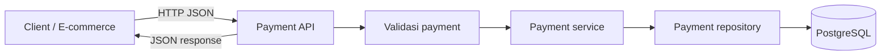
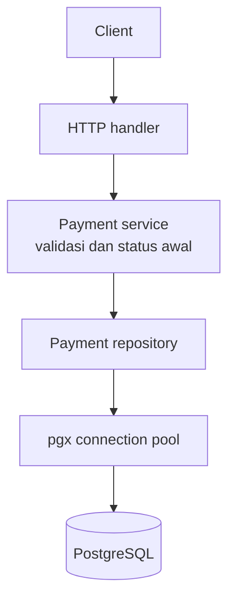

# Financial Payment Integration API - Go

REST API berbasis Go untuk demo integrasi pembayaran dan pemodelan domain keuangan. Kode saat ini menyediakan API payment, idempotency key, verifikasi signature webhook, transisi status, posting ledger debit/kredit, endpoint customer/account, static Swagger UI, serta simulasi in-memory retry queue.

Migration `008_payment_journals_and_reporting.sql` menambahkan journal payment yang seimbang dan immutable, serta laporan payment summary, daily payment, dan general ledger.

Customer/account API memakai tabel melalui migration `007`. Payment management, webhook, dan ledger memakai kontrak payment legacy migrations `001`-`004`, dengan ID numerik `BIGSERIAL` dan kolom `reference`. Schema Neon yang memakai UUID `id`, `payment_number`, dan mewajibkan `customer_id` belum kompatibel dengan operasi payment ini; jalankan fitur pada database legacy yang sesuai atau buat migration rekonsiliasi sebelum deployment ke Neon.

## Masalah Bisnis

Aplikasi e-commerce membutuhkan satu pintu integrasi untuk mencatat permintaan pembayaran secara konsisten. API ini menjadi tempat validasi request dan penyimpanan transaksi sebelum integrasi payment provider ditambahkan. Status `PENDING` berarti transaksi tercatat, bukan berarti provider sudah memproses atau menyetujui pembayaran.



## Alur Create Payment

1. Client mengirim `reference`, `amount`, dan `currency` ke `POST /api/v1/payments`.
2. Handler membaca satu objek JSON dan menolak field yang tidak dikenal.
3. Service memvalidasi reference, amount positif, dan kode currency tiga huruf; currency dinormalisasi menjadi huruf kapital.
4. Service menetapkan status awal `PENDING`.
5. Repository menyimpan transaksi. Reference yang sudah digunakan ditolak oleh constraint unik database. Jika header `Idempotency-Key` dikirim, payment dan key dibuat dalam satu transaksi PostgreSQL: kegagalan menyimpan salah satunya me-rollback keduanya. Key yang sudah digunakan menghasilkan `409 Conflict` (request tidak di-replay sebagai response sukses).
6. API mengembalikan transaksi yang tersimpan dengan HTTP `201 Created`.

## Arsitektur Saat Ini



Kode dipisah ke `handler`, `service`, `repository`, `model`, `database`, `config`, dan `queue`. Endpoint health check tersedia di `/health`. Retry queue bersifat in-memory dan belum dijalankan oleh server API.

## Webhook dan Ledger

Endpoint `POST /api/v1/webhooks/payment` memerlukan header `X-Webhook-Signature` dengan nilai `sha256=<hex HMAC-SHA256 dari raw request body menggunakan WEBHOOK_SECRET>`. Event yang didukung: `payment.success` dan `payment.failed`.

Untuk `payment.success`, satu transaksi PostgreSQL memasukkan event webhook, mengubah status payment dari `PENDING`/`PROCESSING` ke `SUCCESS`, lalu mencatat satu debit dan satu kredit. Unique `event_id` mencegah event yang sama diproses ulang. Ledger ditulis hanya di repository dalam transaksi tersebut; service tidak melakukan posting kedua. Event berbeda untuk payment yang sudah terminal ditolak sebagai transisi status tidak valid.

Setelah migration `008`, setiap payment hanya dapat memiliki satu journal. Header journal menyimpan total debit/kredit yang sama; deferred constraint trigger memastikan entry lengkap dan seimbang saat commit. Header dan entry yang sudah diposting tidak dapat diubah atau dihapus. Retry dengan event ID sama maupun event berbeda untuk payment sukses tidak membuat journal ganda.

Contoh payload:

```json
{
	"event_id": "evt-001",
	"type": "payment.success",
	"reference": "PAY-001"
}
```

Kode akun demo yang dipakai adalah `1010` (debit) dan `2010` (kredit). Ini simulasi posting, bukan integrasi gateway atau chart of accounts produksi.

## API

### Membuat payment (skema legacy)

`POST /api/v1/payments`

Request:

```json
{
	"reference": "PAY-001",
	"amount": 150000,
	"currency": "IDR"
}
```

Response `201 Created`:

```json
{
	"id": 1,
	"reference": "PAY-001",
	"amount": 150000,
	"currency": "IDR",
	"status": "PENDING",
	"created_at": "2026-09-30T03:00:00Z",
	"updated_at": "2026-09-30T03:00:00Z"
}
```

### Melihat semua payment

`GET /api/v1/payments` mengembalikan array dari schema payment legacy. Jika belum ada transaksi, response berupa `[]`.

### Melihat payment berdasarkan ID

`GET /api/v1/payments/{id}` menerima ID numerik `BIGSERIAL`, mengembalikan satu payment, dan menghasilkan `404 Not Found` jika tidak ditemukan.

### Laporan keuangan

- `GET /api/v1/reports/payment-summary?from=2026-10-01&to=2026-10-31` merangkum jumlah payment dan nominal per status serta mata uang.
- `GET /api/v1/reports/daily-payments?from=2026-10-01&to=2026-10-31` mengelompokkan jumlah dan nominal payment per hari serta mata uang. Hari laporan menggunakan UTC.
- `GET /api/v1/reports/general-ledger?from=2026-10-01&to=2026-10-31&account_code=1010` menampilkan debit, kredit, dan saldo berjalan per akun/mata uang.

Semua endpoint menerima `format=csv`, `format=xlsx` (atau `format=excel`), atau `format=pdf` untuk mengunduh laporan. Tanpa parameter format, response tetap JSON. Nama file dikirim melalui `Content-Disposition`.

```sh
curl -OJ 'http://localhost:8080/api/v1/reports/payment-summary?from=2026-10-01&to=2026-10-31&format=xlsx'
curl -OJ 'http://localhost:8080/api/v1/reports/daily-payments?from=2026-10-01&to=2026-10-31&format=csv'
curl -OJ 'http://localhost:8080/api/v1/reports/general-ledger?from=2026-10-01&to=2026-10-31&account_code=1010&format=pdf'
```

Parameter tanggal bersifat opsional dan memakai format `YYYY-MM-DD`; tanggal `to` termasuk seluruh harinya. Nominal dilaporkan terpisah per mata uang tanpa konversi kurs.

### Customer dan account

- `GET /api/v1/customers` dan `POST /api/v1/customers`
- `GET /api/v1/customers/{id}`
- `POST /api/v1/accounts`
- `GET /api/v1/accounts/{id}`
- `GET /api/v1/customers/{customer_id}/accounts`

Validasi customer/account tersedia di service. Pastikan migration `007_create_customers_and_accounts.sql` sudah dijalankan agar tabel yang dibaca repository tersedia.

### Swagger UI

Setelah server berjalan, buka `http://localhost:8080/docs` atau `http://localhost:8080/swagger/`. OpenAPI JSON tersedia di `http://localhost:8080/swagger/swagger.json`. Ubah port URL jika `APP_PORT` bukan `8080`.

### Status error

- `400 Bad Request`: JSON atau input payment tidak valid.
- `404 Not Found`: ID payment tidak ditemukan.
- `409 Conflict`: reference sudah digunakan.
- `500 Internal Server Error`: kegagalan internal.

## Database

Migration SQL `001`-`007` adalah jalur schema legacy/eksperimental dan tidak boleh dijalankan pada database Laravel/Neon yang sudah memiliki tabel UUID. Migration `008_payment_journals_and_reporting.sql` bekerja secara aditif terhadap tabel Laravel yang sudah ada: `customers`, `payments`, `financial_transactions`, `chart_of_accounts`, dan `ledger_entries`. File ini juga menyiapkan fondasi RFQ, quotation, sales order, proforma invoice, sales invoice, pembayaran invoice, produk, gudang, reservasi stok, delivery order, stock movement, nomor dokumen, dan audit trail.

Untuk database Laravel yang sudah ada, jalankan migration Laravel aplikasi terlebih dahulu, lalu tinjau dan jalankan `008_payment_journals_and_reporting.sql`. `009_ledger_integrity_and_reporting.sql` bergantung pada kolom financial domain tersebut dan dijalankan setelah 008 bila belum diterapkan. Jangan jalankan migration `001`-`007` di database itu. Migration SQL ini tidak menggantikan migration PHP Laravel dan belum memiliki runner/ledger versi sendiri.

## Menjalankan

Persyaratan: Go dan PostgreSQL. Atur `DATABASE_URL`, `APP_PORT` (opsional, default `8080`), dan `WEBHOOK_SECRET` (diperlukan untuk menerima webhook). Database harus lebih dulu memiliki tabel Laravel UUID yang disebut di bagian Database. Setelah backup dan pemeriksaan environment, jalankan:

```sh
psql "$DATABASE_URL" -f migrations/008_payment_journals_and_reporting.sql
psql "$DATABASE_URL" -f migrations/009_ledger_integrity_and_reporting.sql
```

Jalankan API dan test:

```sh
go run ./cmd/api
go test ./...
```

Contoh request:

```sh
curl -X POST http://localhost:8080/api/v1/payments \
	-H 'Content-Type: application/json' \
	-d '{"reference":"PAY-001","amount":150000,"currency":"IDR"}'

curl http://localhost:8080/api/v1/payments
curl http://localhost:8080/api/v1/payments/550e8400-e29b-41d4-a716-446655440000
```

Contoh signature webhook dapat dibuat dengan HMAC-SHA256 atas bytes body persis seperti dikirim, menggunakan secret yang sama dengan `WEBHOOK_SECRET`.

## Batasan Saat Ini

- Belum ada integrasi provider pembayaran nyata; webhook demo adalah pemicu perubahan status.
- Idempotency key disimpan atomik bersama payment dan menolak pemakaian ulang, tetapi belum menyimpan dan me-replay hasil request sebelumnya.
- Retry queue adalah utilitas in-memory, belum dihubungkan ke pemrosesan webhook dan hilang saat proses berhenti.
- Posting ledger memakai dua kode akun demo tetap dan tidak mengonversi mata uang.
- Domain finansial lengkap pada migration `005`/`006` masih perlu direkonsiliasi dengan skema payment aktif.
- Gunakan hanya untuk demo/pembelajaran, bukan pemrosesan uang produksi.

