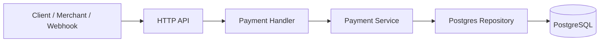
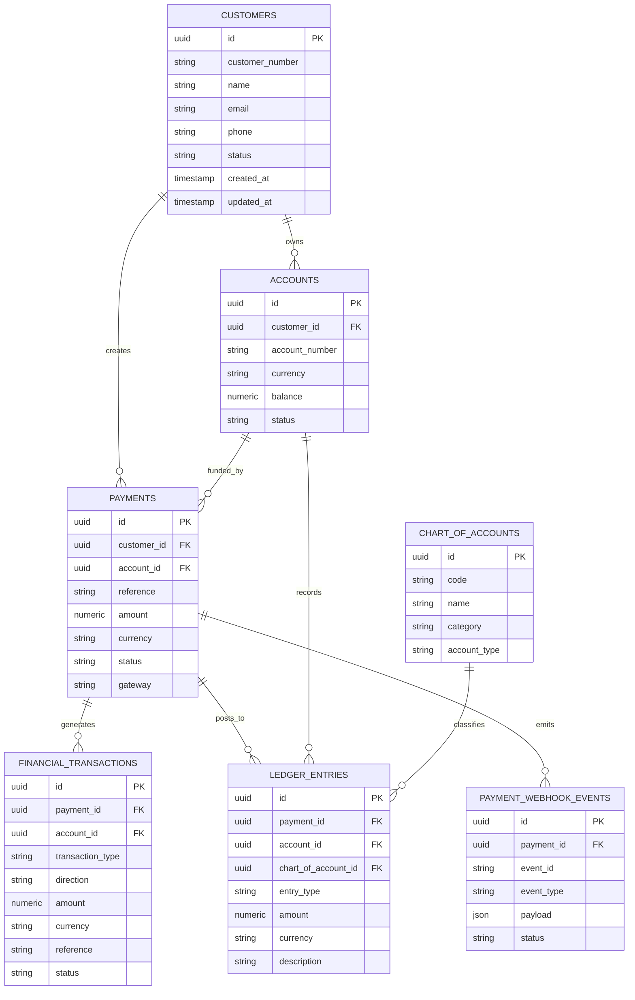

# Financial Payment Integration API

A Go-based backend demonstration for financial domain modeling, payment orchestration, webhook processing, idempotency, and ledger-style accounting.

## Architecture

The project follows a layered design:

- HTTP handlers: transport layer
- Services: business logic and validation
- Repositories: PostgreSQL access layer
- Models: domain entities
- Migration files: schema evolution and persistence contracts

### Core flow

## Domain model

The design models the key financial primitives needed for a real payment platform:

- customers
- accounts
- payments
- financial_transactions
- ledger_entries
- chart_of_accounts
- idempotency_keys
- payment_webhook_events

## ERD summary

## What the project demonstrates

- financial domain modeling
- payment lifecycle and status transitions
- atomic payment and idempotency-key persistence (duplicate keys are rejected; responses are not replayed)
- webhook HMAC validation and event-ID deduplication
- atomic webhook status changes and double-entry demo ledger posting
- in-memory retry queue and dead-letter simulation (not wired to the API server)
- PostgreSQL persistence with relational integrity

## Stack

- Go
- PostgreSQL
- pgx
- HTTP handlers
- SQL migrations

## Current limitations

- no real payment provider integration
- idempotency keys reject reuse but do not replay stored responses
- customer/account migrations (005/006) conflict with the active payment schema (001-004) and need reconciliation
- ledger uses fixed demo account codes and is not production accounting
